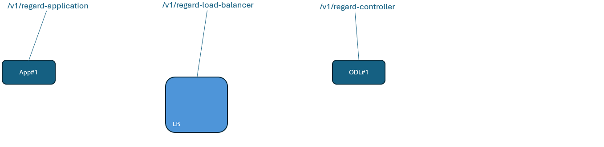

# Example: Sequence of steps to the first ManagementPlaneTransport connection  

## Terms of use  

This chapter is not part of the ControllerDomainManager specification.  
It is intended to explain the basic concepts by using an example.  
It is not regularly checked for consistency with the rest of the documentation.  
In the event of any discrepancies, this chapter is not relevant.  

## Summary Sequence of Steps

- Preparing the ControllerDomainManager  
  - [Mechanics](#mechanics)  
  - [Data](#data)  
- [Documenting the actually existing Elements](#documenting-actually-existing-elements)  
- Defining the target state on these Elements  
  - [Defining the ManagementDomain](#defining-the-managementdomain)  
  - [Adding Controller instances to the ManagementDomain](#adding-controller-instances-to-the-managementdomain)  
  - [Connecting an Application to the ManagementDomain](#connecting-an-application-to-the-managementdomain)  
  - [Establishing the ManagementPlaneTransport segment](#establishing-the-managementplanetransport-segment)  
  - [Mediate the Update of a NetconfClient](#mediate-update-of-the-netconfclient)  

## Preparing the ControllerDomainManager  

### Mechanics  
The following tables are defining the inner mechanics of the ControllerDomainManager:  
- Function  
- ValidationSequence  
- Pulser  
- ErrorCode  

These tables are intended to be configured with all necessary instances upfront the rollout.  
The following services can be applied to modify the entries during runtime:  
- /v1/update-function (changes parameters of functions)  
- /v1/update-validation-sequence (changes list of ValidationFunctions following an InterpretationFunction)  
- /v1/update-pulser (changes periodicity of functions)  
- /v1/update-error-code (changes ImplementationFunction initiated by ErrorCode)  

### Data  
It is assumed that the values of some attributes change in the same way for entire groups of Elements of the same type.  
For example, it seems likely that several Applications are managed with the same instance of ApplicationLayerManager.  
For these attributes, so-called templates are created, which are then referenced by several Elements.  

The following services need to be applied to create the necessary templates upfront:  
- /v1/create-application-template  
- /v1/create-load-balancer-template  
- /v1/create-controller-template  
- /v1/create-mount-point-template  

## Documenting actually existing Elements  

Of course, the physical existence of an Element cannot be the subject of a configuration activity.  
Also its management interface must exist and be known before it is feasible to manage its logical resources.  
Consequently, the provision of a physical Element must precede automated management, and the result of this manual task must be documented into the domain manager.  

The following services need to be applied to document the physical Elements upfront:  
- /v1/regard-application  
- /v1/regard-load-balancer  
- /v1/regard-controller  

  

## Defining the target state on these Elements  

### Defining the ManagementDomain  
A ManagementDomain is a combination of a LogicalController, one or several Controllers (instances of OpenDaylight) and potentially a Forwarding configuration on a LoadBalancer.  

For facilitating flexibly adding and removing Controller instances from the ManagementDomain as a part of an upgrade process, Controller instances are not part of the definition of the ManagementDomain.  

The following service is applied to establish a ManagementDomain on the Elements:  
- /v1/establish-management-domain  

  

### Adding Controller instances to the ManagementDomain  
Adding a Controller instance to the ManagementDomain basically means creating a TCP connection between the Forwarding inside the LoadBalancer and the new Controller instance.  

The following service is applied for adding a Controller instance to a ManagementDomain:  
- /v1/establish-controller-in-management-domain

  

Remarks:  
- The dotted lines indicate the necessary configuration activities on both the already existing Forwarding and Controller instance.  

Not indicated in the diagram:  
- If an Application would have been connected to the ManagementDomain before the Controller instance gets added, the ManagementDomainInterface and the HTTP connection between ManagementDomainInterface and Controller instance (violet line) would be created automatically.  
- If ManagementPlaneTransport connections would have been configured on the ManagementDomain before the Controller instance gets added, the necessary MountPoints would be copied from the LogicalController to the newly added Controller instance automatically.  

### Connecting an Application to the ManagementDomain  
Connection an Application to the ManagementDomain basically means creating ...  
- ... a ManagementDomainInterface inside the Application, ...  
- ... a TCP connection between the ManagementDomainInterface and Forwarding ...  
- ... and an HTTP connection between ManagementDomainInterface and Controller instance.  

The following service is applied for adding a Controller instance to a ManagementDomain:  
- /v1/establish-management-domain-connection  

  

### Establishing the ManagementPlaneTransport segment  
Establishing the ManagementPlaneTransport segment means creating ...  
- ... a new LogicalMountPoint at the LogicalController, ...  
- ... identical MountPoints at the Controller instances that are associated with the ManagementDomain, ...  
- ... CopyLinks between the LogicalMountPoint and the associated MountPoints to document the dependency and for routing the ManagementPlaneTransport connection, and ...  
- ... a ManagementPlaneTransport connection between ManagementDomainInterface at the Application and the LogicalMountPoint at the LogicalController.  

Routes according to the number of Controller instances in the ManagementDomain have to be created at the ManagementPlaneTransportFc. These Routes have to be routed across HttpLink and one of the CopyLinks.  

The following service is applied for establishing a ManagementPlaneTransport segment:  
- /v1/establish-management-plane-transport  

  

### Mediate Update of the NetconfClient  
If the DeviceDomainManager would need to modify the configuration of a NetconfClient, it would address the following service:  
- /v1/mediate-netconf-client-update  

  

### Summary  
Consolidating all Elements, termination points, Links, FDs and FCs into the same diagram results in the following view:  

  
