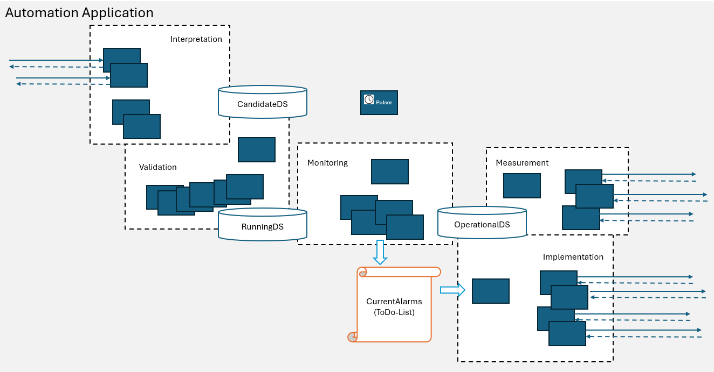

# Functions Overview  

  

### Interpretation  

InterpretationFunctions are changing the content of the CandidateDataStore either driven by external requests or by events in the OperationalDataStore.  
Further details on [InterpretationFunctions](./Interpretation/InterpretationFunctions.md)  

### Validation  

ValidationFunctions analyze the data structure inside the CandidateDataStore for compliance with generic rules.  
Further details on [Validation](./Validation/Validation.md)  

### Measurement  

MeasurementFunctions document the actual conditions of the Elements under management within the domain in the OperationalDataStore.  
Further details on [Measurement](./Measurement/Measurement.md)  

### Monitoring  

MonitoringFunctions compare OperationalDataStore with RunningDataStore. In case of deviations, entries in the alarm list are created.  
Further details on [Monitoring](./Monitoring/Monitoring.md)  

### Implementation  

ImplementationFunctions are attempting to configure the target state (RunningDataStore) into the Elements under management within the domain.  
Further details on [Implementation](./Implementation/Implementation.md)  

### Pulser  

The Pulser is cyclically triggering other Functions.  
Further details on [Pulser](./Pulser/Pulser.md)  
