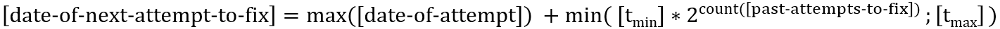

# ImplementationFunctions  

After being triggered by the ImplementationOrchestrator, an ImplementationFunction executes a specific configuration activity on one kind of the Elements that are managed within the domain.  
It documents the result of the configuration attempt and the next step into the CurrentAlarms.  

Managed Elements and associated ImplementationFunctions:  
- [ManagementDomainInterface](#managementdomaininterface)  
  - Update Forwarding  
    - /p1/reconstruct-management-domain-interface  
- [LoadBalancer and Forwarding](#loadbalancer-and-forwarding)  
  - Create Forwarding  
    - /p1/construct-forwarding  
  - Delete Forwarding  
    - /p1/destruct-forwarding  
  - Update Forwarding  
    - /p1/reconstruct-forwarding  
- [Controller and MountPoint](#controller-and-mountpoint)  
  - Update Controller  
    - /p1/reconstruct-controller  
  - Create MountPoint  
    - /p1/construct-mount-point  
  - Delete MountPoint  
    - /p1/destruct-mount-point  
  - Update MountPoint  
    - /p1/reconstruct-mount-point  

**date-of-next-attempt-to-fix:**  
After attempting to transfer the target state from the RunningDS onto the Elements, the ImplementationFunctions have to document the outcome into the CurrentAlarms.  
This includes determining when the next attempt should be made.  
The two parameters for the minimum and maximum wait times (tmin and tmax) can be configured individually for each ImplementationFunction.  
The formula for calculating the time for the next attempt is identical for all ImplementationFunctions: 

  

## ManagementDomainInterface  

Applications are managed by another domain.  
The CDM's scope is limited to ensuring that the ManagementDomainInterface's configuration is aligned with address and authentication at LoadBalancer, respectively Controller.  
So, implementation is limited to configuration of existing ManagementDomainInterfaces.  

### /p1/reconstruct-management-domain-interface  

Is addressing the [ApplicationDomainManager](https://github.com/openBackhaul/ApplicationDomainManager)  

#### Input:  
- application-name  
  Name of the Application that holds the ManagementDomainInterface  
- management-domain  
  Name of the ManagementDomain  

#### Callback:  
- [ADM://v1/mediate-management-domain-interface-update](../../Elements/ADM/adm.yaml)  

#### Made Configurations:  
- The Application's TcpClient is adjusted with the TCP/IP address of either LoadBalancer or Controller  
- The Application's HttpClient is adjusted with the user credentials at the Controllers  

#### Inverse Interpretations:  
Callback$request.body#remote-ip-address:  
- From [remote-ip-address] at LP identified by 'tcp-client' inside LTP identified by [management-domain] inside ControlConstruct identified by [application-name] in RunningDS  

request.body#remote-port:  
- From [remote-port] at LP identified by 'tcp-client' inside LTP identified by [management-domain] inside ControlConstruct identified by [application-name] in RunningDS  

request.body#http-user-name:  
- From [http-user-name] at LP identified by 'http-client' inside LTP identified by [management-domain] inside ControlConstruct identified by [application-name] in RunningDS  

request.body#http-password:  
- From [http-password] at LP identified by 'http-client' inside LTP identified by [management-domain] inside ControlConstruct identified by [application-name] in RunningDS  

#### Feedback into CurrentAlarms:  
- date-of-attempt  
- response-code  
- date-of-next-attempt-to-fix  

#### Output:  
./.

## LoadBalancer and Forwarding

The CDM encapsulates the LoadBalancer.  
It manages the entire logical resource of the LoadBalancer, which is the Forwardings.  

### /p1/construct-forwarding  

Is addressing the nginx server at its [management API](https://demo.nginx.com/swagger-ui/)  

#### Input:  
- load-balancer-name  
  Name of the LoadBalancer at which the new Forwarding shall be created  
- management-domain  
  Name of the new Forwarding  

#### Callback:  
- [nginx:/???](../../Elements/nginx/nginx.yaml)  

#### Made Configurations:  
- New Forwarding is created  
- New Forwarding's TcpClients are created and adjusted with the TCP/IP addresses of the Controllers belonging to the ManagementDomain  

#### Inverse Interpretations:  

Forwarding:  
- Callback$request.body#_nginx-api-specific-version-of-forwarding-name_:  
  - From [CDM://p1/construct-forwarding$request.body#management-domain]  

TcpClients:  
- request.body#_nginx-api-specific-version-of-targets\/target-name_:  
  - From [local-id] at LP [*] inside LTP identified by [management-domain] inside ControlConstruct identified by [load-balancer-name] in RunningDS  

- request.body#_nginx-api-specific-version-of-targets\/remote-ip-address_:  
  - From [remote-ip-address] at LP [*] inside LTP identified by [management-domain] inside ControlConstruct identified by [load-balancer-name] in RunningDS  

- request.body#_nginx-api-specific-version-of-targets\/remote-port_:  
  - From [remote-port] at LP [*] inside LTP identified by [management-domain] inside ControlConstruct identified by [load-balancer-name] in RunningDS  

#### Interpretations:  
If the Callback would return local-ip-address and local-port of the newly created Forwarding, it could be interpreted into the Operational DS; if not, this information would be measured.  

#### Feedback into CurrentAlarms:  
- date-of-attempt  
- response-code  
- date-of-next-attempt-to-fix  

#### Output:  
./.

### /p1/destruct-forwarding  

Is addressing the nginx server at its [management API](https://demo.nginx.com/swagger-ui/)  

#### Input:  
- load-balancer-name  
  Name of the LoadBalancer at which the obsolete Forwarding shall be purged  
- management-domain  
  Name of the obsolete Forwarding  

#### Callback:  
- [nginx:/???](../../Elements/nginx/nginx.yaml)  

#### Made Configurations:  
- Obsolete Forwarding is purged  

#### Inverse Interpretations:  
- Callback$request.body#_nginx-api-specific-version-of-forwarding-name_:  
  - From [CDM://p1/destruct-forwarding$request.body#management-domain]  

#### Feedback into CurrentAlarms:  
- date-of-attempt  
- response-code  
- date-of-next-attempt-to-fix  

#### Output:  
./.

### /p1/reconstruct-forwarding  

Is addressing the nginx server at its [management API](https://demo.nginx.com/swagger-ui/)  

#### Input:  
- load-balancer-name  
  Name of the LoadBalancer at which the Forwarding shall be updated  
- management-domain  
  Name of the Forwarding that shall be updated  

#### Callback:  
- [nginx:/???](../../Elements/nginx/nginx.yaml)  

#### Made Configurations:  
- All Forwarding's TcpClients are adjusted with the TCP/IP addresses of the Controllers belonging to the ManagementDomain  

#### Inverse Interpretations:  

Forwarding:  
- Callback$request.body#_nginx-api-specific-version-of-forwarding-name_:  
  - From [CDM://p1/reconstruct-forwarding$request.body#management-domain]  

TcpClients:  
- request.body#_nginx-api-specific-version-of-targets\/target-name_:  
  - From [local-id] at LP [*] inside LTP identified by [management-domain] inside ControlConstruct identified by [load-balancer-name] in RunningDS  

- request.body#_nginx-api-specific-version-of-targets\/remote-ip-address_:  
  - From [remote-ip-address] at LP [*] inside LTP identified by [management-domain] inside ControlConstruct identified by [load-balancer-name] in RunningDS  

- request.body#_nginx-api-specific-version-of-targets\/remote-port_:  
  - From [remote-port] at LP [*] inside LTP identified by [management-domain] inside ControlConstruct identified by [load-balancer-name] in RunningDS  

#### Interpretations:  
If the Callback would return local-ip-address and local-port of the newly created Forwarding, it could be interpreted into the Operational DS; if not, this information would be measured.  

#### Feedback into CurrentAlarms:  
- date-of-attempt  
- response-code  
- date-of-next-attempt-to-fix  

#### Output:  
./.  

## Controller and MountPoint  

The CDM encapsulates the Controller.  
It manages the entire logical resource of the Controller, which is the MountPoints.  

### /p1/reconstruct-controller

Is addressing the OpenDaylight controller  

#### Input:  
- controller-name  
  Name of the Controller that shall be updated  

#### Callback:  
- [ODL://rests/???](../../Elements/OpenDaylight/OpenDaylight.yaml) 

#### Made Configurations:  
- User credentials are updated  

#### Inverse Interpretations:  
- Callback$???:  
  - From [http-user-name] at LP[*] inside LTP identified by 'controller-manager' inside ControlConstruct identified by [controller-name] in RunningDS  
- Callback$???:  
  - From [http-password] at LP[*] inside LTP identified by 'controller-manager' inside ControlConstruct identified by [controller-name] in RunningDS  

#### Feedback into CurrentAlarms:  
- date-of-attempt  
- response-code  
- date-of-next-attempt-to-fix  

#### Output:  
./.  

### /p1/construct-mount-point  

Is addressing the OpenDaylight controller  

#### Input:  
- controller-name  
  Name of the Controller at which the new MountPoint shall be created  
- device-name  
  Name of the new MountPoint  

#### Callback:  
- [ODL://rests/data/network-topology:network-topology/topology=topology-netconf](../../Elements/OpenDaylight/OpenDaylight.yaml)  

#### Made Configurations:  
- New MountPoint is created  

#### Inverse Interpretations:  
- Callback$request.body#network-topology:node/node-id:  
  - From [CDM://p1/construct-mount-point$request.body#device-name]  

#### Feedback into CurrentAlarms:  
- date-of-attempt  
- response-code  
- date-of-next-attempt-to-fix  

#### Output:  
./.  

### /p1/destruct-mount-point  

Is addressing the OpenDaylight controller  

#### Input:  
- controller-name  
  Name of the Controller at which the obsolete MountPoint shall be purged  
- device-name  
  Name of the obsolete MountPoint  

#### Callback:  
- [ODL://rests/data/network-topology:network-topology/topology=topology-netconf/node={mount-name}](../../Elements/OpenDaylight/OpenDaylight.yaml)  

#### Made Configurations:  
- Obsolete MountPoint is purged  

#### Inverse Interpretations:  
- Callback$request.parameters#mount-name:  
  - From [CDM://p1/destruct-mount-point$request.body#device-name]  

#### Feedback into CurrentAlarms:  
- date-of-attempt  
- response-code  
- date-of-next-attempt-to-fix  

#### Output:  
./.

### /p1/reconstruct-mount-point  

Is addressing the OpenDaylight controller  

#### Input:  
- controller-name  
  Name of the Controller at which the MountPoint shall be updated  
- device-name  
  Name of the MountPoint that shall be updated  

#### Callback:  
- [ODL://rests/data/network-topology:network-topology/topology=topology-netconf/node={mount-name}](../../Elements/OpenDaylight/OpenDaylight.yaml)  

#### Made Configurations:  
- All parameters at the MountPoint are updated  

#### Inverse Interpretations:  
- Callback$request.parameters#mount-name:  
  - From [CDM://p1/destruct-mount-point$request.body#device-name]  

- request.body#network-topology:node/node-id:  
  - From [CDM://p1/destruct-mount-point$request.body#device-name]  

- request.body#network-topology:node/netconf-node-topology:host:  
  - From [remote-ip-address] at LP identified by 'tcp-client' inside LTP identified by [device-name] inside ControlConstruct identified by [controller-name] in RunningDS  

- request.body#network-topology:node/netconf-node-topology:port:  
  - From [remote-port] at LP identified by 'tcp-client' inside LTP identified by [device-name] inside ControlConstruct identified by [controller-name] in RunningDS  

- request.body#network-topology:node/netconf-node-optional:notification/subscribe:  
  - From [notification-subscribe] at LP identified by 'netconf-client' inside LTP identified by [device-name] inside ControlConstruct identified by [controller-name] in RunningDS  

- request.body#network-topology:node/netconf-node-optional:notification/stream-name:  
  - From [notification-stream-name] at LP identified by 'netconf-client' inside LTP identified by [device-name] inside ControlConstruct identified by [controller-name] in RunningDS  

- request.body#network-topology:node/netconf-node-topology:username:  
  - From [netconf-user-name] at LP identified by 'netconf-client' inside LTP identified by [device-name] inside ControlConstruct identified by [controller-name] in RunningDS  

- request.body#network-topology:node/netconf-node-topology:password:  
  - From [netconf-password] at LP identified by 'netconf-client' inside LTP identified by [device-name] inside ControlConstruct identified by [controller-name] in RunningDS  

- request.body#network-topology:node/netconf-node-topology:sleep-factor:  
  - From [sleep-factor] at Profile (with category=='mountpoint') identified by mountPointTemplateName==[_template] from inside LTP identified by [device-name] inside ControlConstruct identified by [controller-name] in RunningDS  

- request.body#network-topology:node/netconf-node-topology:max-connection-attempts:  
  - From [max-connection-attempts] at Profile (with category=='mountpoint') identified by mountPointTemplateName==[_template] from inside LTP identified by [device-name] inside ControlConstruct identified by [controller-name] in RunningDS  

- request.body#network-topology:node/netconf-node-topology:default-request-timeout-millis:  
  - From [default-request-timeout-millis] at Profile (with category=='mountpoint') identified by mountPointTemplateName==[_template] from inside LTP identified by [device-name] inside ControlConstruct identified by [controller-name] in RunningDS  

- request.body#network-topology:node/netconf-node-topology:tcp-only:  
  - From [tcp-only] at Profile (with category=='mountpoint') identified by mountPointTemplateName==[_template] from inside LTP identified by [device-name] inside ControlConstruct identified by [controller-name] in RunningDS  

- request.body#network-topology:node/netconf-node-topology:concurrent-rpc-limit:  
  - From [concurrent-rpc-limit] at Profile (with category=='mountpoint') identified by mountPointTemplateName==[_template] from inside LTP identified by [device-name] inside ControlConstruct identified by [controller-name] in RunningDS  

- request.body#network-topology:node/netconf-node-topology:schema-cache-directory:  
  - From [schema-cache-directory] at Profile (with category=='mountpoint') identified by mountPointTemplateName==[_template] from inside LTP identified by [device-name] inside ControlConstruct identified by [controller-name] in RunningDS  

- request.body#network-topology:node/netconf-node-topology:between-attempts-timeout-millis:  
  - From [between-attempts-timeout-millis] at Profile (with category=='mountpoint') identified by mountPointTemplateName==[_template] from inside LTP identified by [device-name] inside ControlConstruct identified by [controller-name] in RunningDS  

- request.body#network-topology:node/netconf-node-topology:reconnect-on-changed-schema:  
  - From [reconnect-on-changed-schema] at Profile (with category=='mountpoint') identified by mountPointTemplateName==[_template] from inside LTP identified by [device-name] inside ControlConstruct identified by [controller-name] in RunningDS  

- request.body#network-topology:node/netconf-node-topology:keepalive-delay:  
  - From [keepalive-delay] at Profile (with category=='mountpoint') identified by mountPointTemplateName==[_template] from inside LTP identified by [device-name] inside ControlConstruct identified by [controller-name] in RunningDS  

#### Feedback into CurrentAlarms:  
- date-of-attempt  
- response-code  
- date-of-next-attempt-to-fix  

#### Output:  
./.  

