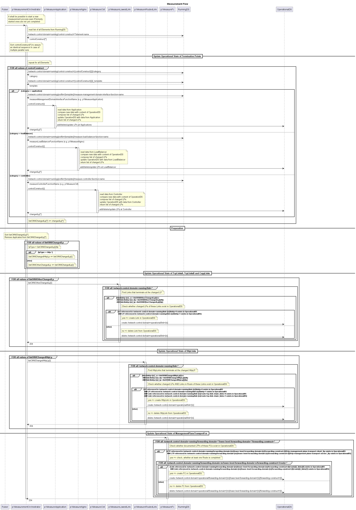

# Measurement  

Tasks of the MeasurementFunctions  
- Collect data from the managed Elements  
- Interpret that data into the logical objects of the data structure inside the OperationalDS  
- Encapsulate the proprietary interfaces of the managed Elements  

Tasks of the MeasurementOrchestrator  
- Invoke the MeasurementFunctions after being cyclically triggered by the Pulser  

Measurement results:  
- Availability of  
  - termination points or  
  - connections  
- Currently effective configuration of the managed Elements  

Managed Elements and associated MeasurementFunctions:  
- LoadBalancer  
  - p1MeasureNginx  
- Controller  
  - p1MeasureOdl  

Managed Endpoints that are encapsulated by a neighboring domain:  
- ManagementDomainInterface  
  - p1MeasureApplication  

Managed Connections and associated MeasurementFunctions:  
- TcpLinkA, TcpLinkB, and CopyLink  
  - p1MeasureLowestLink  
- HttpLink  
  - p1MeasureRoutedLink  
- ManagementPlaneTransportFc  
  - p1MeasureFc  

Measurement philosophy:  
- The logical resources on the managed Elements are completely and exclusively subordinate to the domain manager  
- The measurement concept must cover all consumers of these resources, also to facilitate removing consumers that are not part of the target state  

Sequence Diagram:

  
