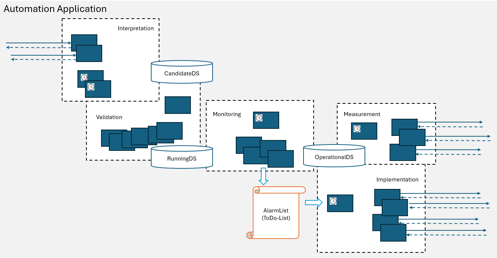

# Functions Overview  

  

**Interpretation**  
[InterpretationFunctions](./Interpretation) are changing the content of the CandidateDataStore either driven by external requests or by events in the OperationalDataStore.  

**Validation**  
[ValidationFunctions](./Validation) analyze the data structure inside the CandidateDataStore for compliance with generic rules.  

    Measurement, Monitoring, Implementation and Pulser are not included in the v1.0.0_spec.  
    Please, ignore these segments during implementing v1.0.0_impl.  

**Measurement**  
[MeasurementFunctions](./Measurement) document the actual conditions of the Elements under management within the domain in the OperationalDataStore.  

**Monitoring**  
[MonitoringFunctions](./Monitoring) compare OperationalDataStore with RunningDataStore. In case of deviations, entries in the alarm list are created.  

**Implementation**  
[ImplementationFunctions](./Implementation) are attempting to configure the target state (RunningDataStore) into the Elements under management within the domain.  

**Pulser**  
The [Pulser](./Pulser) is cyclically triggering other Functions.   
