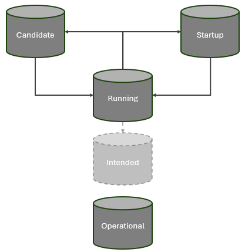

# ControllerDomainManager Information Structure  

The internal data stores are structured according to the NMDA concepts ([IETF RFC 8342](https://datatracker.ietf.org/doc/html/rfc8342)).  

  

The information within the three data stores CandidateDS, RunningDS and OperationalDS has the following identical structure (while StartupDS and IntendedDS might be disregarded):  

  
 
The [DomainController (DC)](./schemas/00_DomainController.yaml) ([description](Index.md#domaincontroller)) holds  
- the parameter settings of the [Functions (F)](./schemas/02_Function.yaml) ([description](Index.md#function)),  
- definitions of [ValidationSequences (VS)](./schemas/03_ValidationSequence.yaml) ([description](../Functions/Validation/ValidationOrchestrator.md)),  
- definitions of [Pulses (P)](./schemas/04_Pulser.yaml) ([description](../Functions/Pulser/Pulser.md)),  
- definitions of [ErrorCodes (EC)](./schemas/05_ErrorCode.yaml) ([description](../Functions/Implementation/ImplementationOrchestrator.md)) including their countermeasures,  
- and the [CurrentAlarms (CA)](./schemas/06_CurrentAlarm.yaml) ([description](../Functions/Monitoring/MonitoringFunctions.md#currentalarms)).  

Up to four semantically different documentations of the same [Network (NCD)](./schemas/09_NetworkControlDomain.yaml) are composed from instances of,   

- pre-defined templates (Profiles) ([description](Index.md#profiles)) 
  - [applicationTemplate (P)](./schemas/10_ApplicationTemplate.yaml)  
  - [LoadBalancerTemplate (P)](./schemas/20_LoadBalancerTemplate.yaml)  
  - [ControllerTemplate (P)](./schemas/30_ControllerTemplate.yaml)  
  - [MountPointTemplate (P)](./schemas/35_MountPointTemplate.yaml)  

- network elements (ControlConstructs) with interfaces (LogicalTerminationPoints)  
  - [Application (CC)](./schemas/11_Application.yaml) incl. [ManagementDomainInterface (LTP)](./schemas/12_ManagementDomainInterface.yaml) ([description](Index.md#managementdomaininterface))  
  - [LoadBalancer (CC)](./schemas/21_LoadBalancer.yaml) incl. [Forwarding (LTP)](./schemas/22_Forwarding.yaml) ([description](Index.md#forwarding))  
  - [Controller (CC)](./schemas/31_Controller.yaml) incl. [MountPoint (LTP)](./schemas/36_MountPoint.yaml) ([description](Index.md#mountpoint))  
  - [LogicalController (CC)](./schemas/41_LogicalController.yaml) incl. [LogicalMountPoint (LTP)](./schemas/42_LogicalMountPoint.yaml) ([description](Index.md#logicalmountpoint))  

- and connections (Links and ForwardingConstructs).  
  - [TcpConnectionA (L)](./schemas/80_TcpConnectionA.yaml) ([description](Index.md#tcpconnectiona))  
  - [TcpConnectionB (L)](./schemas/81_TcpConnectionB.yaml) ([description](Index.md#tcpconnectionb))  
  - [CopyConnection (L)](./schemas/85_CopyConnection.yaml) ([description](Index.md#copyconnection))    
  - [ManagementPlaneTransportConnection (FC)](./schemas/88_ManagementPlaneTransportConnection.yaml) ([description](Index.md#managementplanetransportconnection))  
