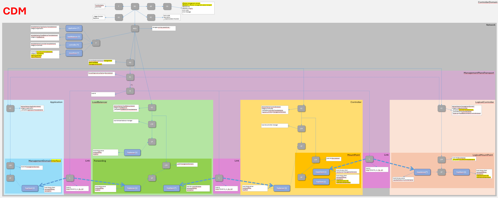

# DeviceDomainManager Information Structure  

The internal data stores shall be structured according to the NMDA concepts ([IETF RFC 8342](https://datatracker.ietf.org/doc/html/rfc8342)).  

The information within the three data stores shall have the following identical structure:  

  

The [DomainController (DC)](./schemas/00_DomainController.yaml) holds  
- the parameter settings of the [Functions (F)](./schemas/02_Function.yaml),  
- definitions of [ValidationSequences (VS)](./schemas/03_ValidationSequence.yaml),  
- definitions of [ErrorCodes (EC)](./schemas/05_ErrorCode.yaml) including their countermeasures,  
- and the [CurrentAlarms (CA)](./schemas/06_CurrentAlarm.yaml) at the DeviceDomainManager.  

Four semantically different documentations of the same [Network (NCD)](./schemas/09_NetworkControlDomain.yaml) (running, operational, startup and candidate) are composed from instances of,   

- pre-defined templates (Profiles)  
  - [ApplicationTemplate (P)](./schemas/10_ApplicationTemplate.yaml)  
  - [LoadBalancerTemplate (P)](./schemas/20_LoadBalancerTemplate.yaml)  
  - [ControllerTemplate (P)](./schemas/30_ControllerTemplate.yaml)  
  - [LogicalControllerTemplate (P)](./schemas/40_LogicalControllerTemplate.yaml)  

- network elements (ControlConstructs) with interfaces (LogicalTerminationPoints)  
  - [Application (CC)](./schemas/11_Application.yaml) incl. [ManagementDomain (LTP)](./schemas/12_ManagementDomain.yaml)  
  - [LoadBalancer (CC)](./schemas/21_LoadBalancer.yaml) incl. [Forwarding (LTP)](./schemas/22_Forwarding.yaml)  
  - [Controller (CC)](./schemas/31_Controller.yaml) incl. [MountPoint (LTP)](./schemas/32_MountPoint.yaml)  
  - [LogicalController (CC)](./schemas/41_LogicalController.yaml) incl. [LogicalMountPoint (LTP)](./schemas/42_LogicalMountPoint.yaml)  

- and connections (Links and ForwardingConstructs).  
  - [TcpConnectionA (L)](./schemas/80_TcpConnectionA.yaml)  
  - [TcpConnectionB (L)](./schemas/81_TcpConnectionB.yaml)  
  - [CopyConnection (L)](./schemas/82_CopyConnection.yaml)  
  - [ManagementPlaneTransportConnection (FC)](./schemas/88_ManagementPlaneTransportConnection.yaml)  
