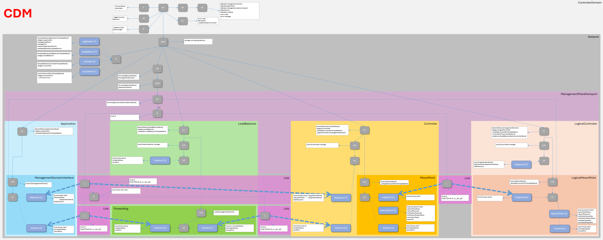

# ControllerDomainManager Information Structure  

## Introduction

The internal data stores are structured according to the NMDA concepts ([IETF RFC 8342](https://datatracker.ietf.org/doc/html/rfc8342)).  

  

This specification prescribes an identical information structure in the following data stores:  
- CandidateDS,  
- RunningDS and  
- OperationalDS  

The StartupDS might be obsolete, if the entire internal data structure is implemented as a persistent data base. Otherwise it would be a persistent copy of the RunningDS.  

The IntendedDS is obsolete, as it is not planned to store any data in the proprietary data formats of the managed Elements.  

  

An [Index](./Index.md) is provided to explain the objects and abbreviations shown in the diagram.  
An [Example](../Functions/Example.md) helps to understand the practical meaning of the objects.  

## Detailed Schemas

The [DomainController (DC)](./schemas/00_DomainController.yaml) holds  
- the parameter settings of the [Functions (F)](./schemas/02_Function.yaml),  
- definitions of [ValidationSequences (VS)](./schemas/03_ValidationSequence.yaml),  
- definitions of [Pulses (P)](./schemas/04_Pulser.yaml),  
- definitions of [ErrorCodes (EC)](./schemas/05_ErrorCode.yaml) including their countermeasures,  
- and the [CurrentAlarms (CA)](./schemas/06_CurrentAlarm.yaml).  

Up to four semantically different documentations of the same [Network (NCD)](./schemas/09_NetworkControlDomain.yaml) are composed from instances of,   

- pre-defined templates (Profiles)  
  - [applicationTemplate (P)](./schemas/10_ApplicationTemplate.yaml)  
  - [LoadBalancerTemplate (P)](./schemas/20_LoadBalancerTemplate.yaml)  
  - [ControllerTemplate (P)](./schemas/30_ControllerTemplate.yaml)  
  - [MountPointTemplate (P)](./schemas/35_MountPointTemplate.yaml)  

- network elements (ControlConstructs) with interfaces (LogicalTerminationPoints)  
  - [Application (CC)](./schemas/11_Application.yaml) incl. [ManagementDomainInterface (LTP)](./schemas/12_ManagementDomainInterface.yaml)  
  - [LoadBalancer (CC)](./schemas/21_LoadBalancer.yaml) incl. [Forwarding (LTP)](./schemas/22_Forwarding.yaml)  
  - [Controller (CC)](./schemas/31_Controller.yaml) incl. [MountPoint (LTP)](./schemas/36_MountPoint.yaml)  
  - [LogicalController (CC)](./schemas/41_LogicalController.yaml) incl. [LogicalMountPoint (LTP)](./schemas/42_LogicalMountPoint.yaml)  

- and connections (Links and ForwardingConstructs).  
  - [TcpConnectionA (L)](./schemas/80_TcpConnectionA.yaml)  
  - [TcpConnectionB (L)](./schemas/81_TcpConnectionB.yaml)  
  - [CopyConnection (L)](./schemas/85_CopyConnection.yaml)  
  - [ManagementPlaneTransportConnection (FC)](./schemas/88_ManagementPlaneTransportConnection.yaml)  
