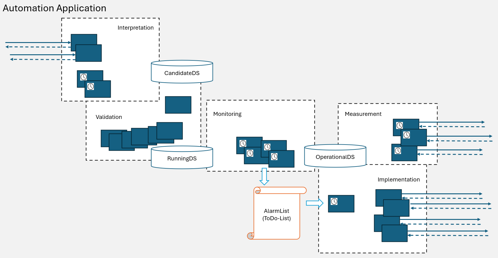

# ControllerDomainManager List of Functions  

**Interpretation Functions:**  
Shall translate abstract requests from outside into concrete logical objects in the internal data structure.  

**Validation Functions:**

  

### Interpretation  
- v1-create-controller-template / v1-create-mediator-vm-template / v1-create-device-template  
  - Copies content of RunningDS into CandidateDS  
  - Creates the specified Profile object in CandidateDS  
  - Calls p1-validation-orchestrator  
  - IF ResponseCode==204  
    - Copies content of CandidateDS into RunningDS  
    - Responds 204 to requestor  
    ELSE  
    - Responds ResponseCode to requestor  
- v1-delete-controller-template / v1-delete-mediator-vm-template / v1-delete-device-template  
  - Copies content of RunningDS into CandidateDS  
  - Deletes the specified Profile object from CandidateDS  
  - Calls p1-validation-orchestrator  
  - IF ResponseCode==204  
    - Copies content of CandidateDS into RunningDS  
    - Responds 204 to requestor  
    ELSE  
    - Responds ResponseCode to requestor  
- v1-update-controller-template / v1-update-mediator-vm-template / v1-update-device-template  
  - Copies content of RunningDS into CandidateDS  
  - Updates the specified values of the specified Profile object in CandidateDS  
  - Calls p1-validation-orchestrator  
  - IF ResponseCode==204  
    - Copies content of CandidateDS into RunningDS  
    - Responds 204 to requestor  
    ELSE  
    - Responds ResponseCode to requestor  
- v1-regard-controller / v1-regard-mediator-vm
  - Copies content of RunningDS into CandidateDS  
  - Creates the specified CC object in CandidateDS  
  - Calls p1-validation-orchestrator  
  - IF ResponseCode==204  
    - Copies content of CandidateDS into RunningDS  
    - Responds 204 to requestor  
    ELSE  
    - Responds ResponseCode to requestor  
- v1-disregard-controller / v1-disregard-mediator-vm
  - Copies content of RunningDS into CandidateDS  
  - Deletes the specified CC object from CandidateDS  
  - Calls p1-validation-orchestrator  
  - IF ResponseCode==204  
    - Copies content of CandidateDS into RunningDS  
    - Responds 204 to requestor  
    ELSE  
    - Responds ResponseCode to requestor  
- v1-establish-management-plane-transport  
  - Copies content of RunningDS into CandidateDS  
  - Creates the specified (Device) CC object (incl. LTP and LPs) in CandidateDS  
  - Creates the specified (MountPoint, MediatorProcess) LTP objects (incl. LPs) in CandidateDS  
  - Creates the Link objects (NetconfLink, SnmpLink) in CandidateDS  
  - Creates the FC object in CandidateDS  
  - Calls p1-validation-orchestrator  
  - IF ResponseCode==204  
    - Copies content of CandidateDS into RunningDS  
    - Responds 204 to requestor  
    ELSE  
    - Responds ResponseCode to requestor  
- v1-dismantle-management-plane-transport
  - Copies content of RunningDS into CandidateDS  
  - Deletes the LTP objects (MountPoint, MediatorProcess) that are referenced by the Links that are referenced by the specified FC from CandidateDS  
  - Deletes the Link objects (NetconfLink, SnmpLink) that are referenced by the specified FC from CandidateDS  
  - Deletes the CC objects (Device) that is referenced by the specified FC from CandidateDS  
  - Deletes the specified FC from CandidateDS  
  - Calls p1-validation-orchestrator  
  - IF ResponseCode==204  
    - Copies content of CandidateDS into RunningDS  
    - Responds 204 to requestor  
    ELSE  
    - Responds ResponseCode to requestor  

### Validation  
- p1-validation-orchestrator  
  - Calls a configurable set of ValidationTestFunctions listed below  
  - IF all ResponseCodes==204  
    - Responds 204  
    ELSE  
    - Responds the first ResponseCode different from 204 and terminates  

_(See the following entries as examples. List of ValidationTestFunctions is to be defined by ApplicationOwner:)_  

- p1-ensure-unique-template-names  
  Ensures that all Profile definitions have unique template-names  
- p1-ensure-all-elements-referencing-an-existing-template  
  Ensures that all Profile definitions have unique template-names  
- p1-ensure-all-existing-controllers-complying-with-template-definition  
  Ensures that updated template is not in conflict with existing controllers  
- p1-ensure-all-existing-mediator-vms-complying-with-template-definition  
  Ensures that updated template is not in conflict with existing mediatorVms  
- p1-ensure-all-existing-devices-complying-with-template-definition  
  Ensures that updated template is not in conflict with existing devices  
- p1-ensure-unique-element-names  
  Ensures that all CC definitions have unique element-names  
- p1-ensure-all-cc-referenced-by-fc-in-operational-exist-in-candidate  
  Ensures that no CC of an operational FC gets deleted  
- p1-ensure-all-lp-referenced-by-link-in-operational-exist-in-candidate  
  Ensures that no LP of an operational Link gets deleted  
- p1-ensure-unique-local-ids-at-links  
  Ensures that the local-ids at links are unique  
- p1-ensure-unique-mount-names-at-fcs  
  Ensures that there is just a single FC per MountName  
- p1-ensure-every-fc-having-at-least-one-route  
  Ensures every FC being routed
- p1-ensure-every-route-connecting-end-to-end
  Ensures every route referencing the links necessary for a path between the endpoints of the FC  

### Measurement  

_(See the following entries as examples._  
_They might be technically wrong, or not inconsistent._  
_List of MeasurementFunctions is to be defined by ApplicationOwner:)_  

- p1-measure-management-plane-transport-availability (cyclic process)  
  - Picks next FC object from rolling list in RunningDS  
  - Sends Restconf request to MountPoint to check ManagementPlaneTransport connection to Device  
  - IF expected CC::externalLabel
    - Creates FC object and all related objects (both Links, CC and both LTPs) similar to RunningDS in OperationalDS (might already have existed)  
    - Deletes all entries related to the FC in the CurrentAlarms (there might be no entry)  
    ELSE  
    - Deletes FC object from OperationalDS (might not have existed)  
    - Creates an entry with ErrorCode [might depend on the exact measurement result] at the FC object in the CurrentAlarms (might have already existed)  
    - calls p1-measure-snmp-link-availability  
    - IF available  
      - calls p1-measure-netconf-link-availability  
  - start over
- p1-measure-snmp-link-availability  
  - Sends Netconf request to MediatorProcess to check SnmpLink to Device  
  - IF expected CC::externalLabel
    - Creates Link object and all related objects (CC and LTP) similar to RunningDS in OperationalDS (might already have existed)  
    - Deletes all entries related to the Link in the CurrentAlarms (there might be no entry)  
    - Returns true
    ELSE  
    - Deletes Link object from OperationalDS (might not have existed)  
    - Creates an entry with ErrorCode [might depend on the exact measurement result] at the Link object in the CurrentAlarms (might have already existed)  
    - calls p1-measure-device-availability  
    - IF available  
      - calls p1-measure-mediator-process-availability  
    - Returns false
- p1-measure-device-availability  
  - Pings TcpServer of Device  
  - IF responding  
    - Creates CC object (Device) similar to RunningDS in OperationalDS (might already exist)  
    - Deletes all entries related to the CC in the CurrentAlarms (there might be no entry)  
    - Returns true  
    ELSE  
    - Deletes CC object from OperationalDS (might not have existed)  
    - Creates an entry with ErrorCode [might depend on the exact measurement result] at the missing CC object in the CurrentAlarms (might have already existed)  
    - Returns false  
- p1-measure-mediator-process-availability  
  - Request MIM://v1/list-mediator-instances  
  - IF MountName of FC in the list of MediatorProcesses  
    - Creates LTP object (MediatorProcess) similar to RunningDS in OperationalDS (might already exist)  
    - Deletes all entries related to the LTP in the CurrentAlarms (there might be no entry)  
    - Returns true  
    ELSE  
    - Deletes LTP object from OperationalDS (might not have existed)  
    - Creates an entry with ErrorCode [might depend on the exact measurement result] at the missing LTP object in the CurrentAlarms (might have already existed)  
    - Returns false  
- p1-measure-netconf-link-availability
  - Request CDM://v1/inform-about-mount-point
  - IF MountPoint exists
    - Creates LTP object (MountPoint) similar to RunningDS in OperationalDS (might already exist)  
    - Deletes all entries related to the LTP in the CurrentAlarms (there might be no entry)  
    - IF state==connected  
      - Creates Link object (NetconfLink) similar to RunningDS in OperationalDS (might already have existed)  
      - Deletes all entries related to the Link in the CurrentAlarms (there might be no entry)  
      - Returns true
      ELSE  
      - Deletes Link object from OperationalDS (might not have existed)  
      - Creates an entry with ErrorCode [might depend on the exact measurement result] at the missing Link object in the CurrentAlarms (might have already existed)  
      - Return false
    ELSE  
    - Deletes Link object (NetconfLink) from OperationalDS (might not have existed)  
    - Creates an entry with ErrorCode [might depend on the exact measurement result] at the missing Link object in the CurrentAlarms (might have already existed)  
    - Deletes LTP object (MountPoint) from OperationalDS (might not have existed)  
    - Creates an entry with ErrorCode [might depend on the exact measurement result] at the missing LTP object in the CurrentAlarms (might have already existed)  
    - Returns false  

### Monitoring  
- ./. (cyclic operation)  

### Implementation  
- p1-implementation-orchestrator (cyclic operation)  
  - Picks next FC object from rolling list in CurrentAlarms  
  - Identifies errored object and checks dateOfNextAttemptToFix  
    - IF currentDate > dateOfNextAttemptToFix  
      - Requests ImplementationFunction according definitions in ErrorCode table  
      - Receives Response  
  - Start over with next FC  

_(List of ImplementationFunctions is to be defined by ApplicationOwner:)_  

### Concepts for defining ImplementationFunctions  
**Shaping**
During discussions we found out that:  
- With increasing number of deviations between RunningDS and OperationalDS some deadlock might occur.  
- It is unclear how roll-back of partly executed implementation sequences could be defined in case of idempotent functions.  

The following concepts should help minimizing the risk of dead lock and partly executed implementation sequences:  
- Implementation sequences should be short (this is why the information structure is now limiting to a single function).  
- Each implementation sequence shall terminate in a stable state more close to the target state defined in the RunningDS.  
- Steps that are increasing the options in the total system (e.g. releasing limited resources) shall be done first. Steps that are narrowing down the options in the total system (e.g. allocating resources) shall be done in a separated sequence later.  

**ResponseCode**
The results of the implementation attempts shall be documented into the CurrentAlarms.  
The ResponseCodes of the ImplementationFunctions shall relate to the processing of the request, not to the success or failure of the configuration task.  
